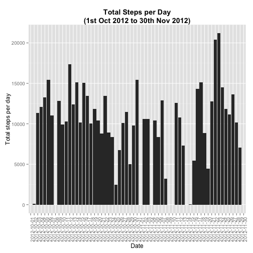
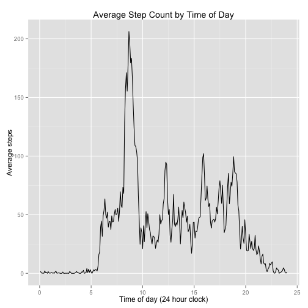
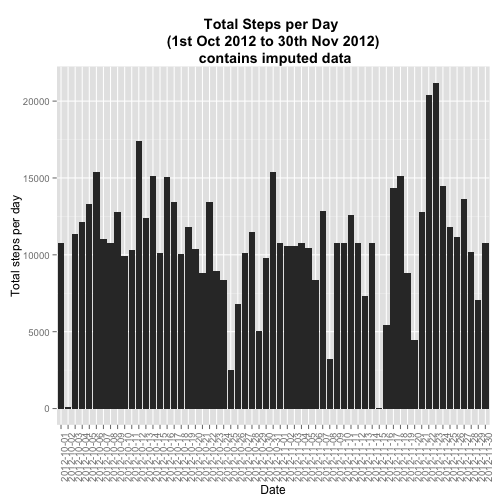
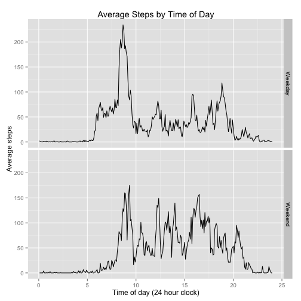

# Reproducible Research: Peer Assessment 1


## Loading and preprocessing the data

### Load data

```r
setwd("~/RepData_PeerAssessment1")
data <- read.csv("activity.csv")
```

Data is in 3 columns:

1. Steps
2. Date
3. Time in 5 minute intervals: 3 or 4 digits
  * hours < 10: hr, min*10, min
  * hours >= 10 hr*10, hr, min*10, min

### Pre-process data
This requires processing to get format: %Y-%m-%d %H:%M

```r
library(lubridate)
minutes <- sprintf("%04d", data$interval)  # adds leading 0s
minutes1 <- gsub("(\\d\\d)", "\\1:", minutes)  # adds colon every second digit
minutes2 <- paste(minutes1, "00", sep = "")  # adds 00 seconds
data <- cbind(data, minutes2)  # adds time column to dataset
datetime <- paste(data$date, data$minutes2)  # combines date and time columns
datetime1 <- ymd_hms(datetime)  # converts to date format for analysis
data <- cbind(data, datetime1)  # add to dataset
```


## What is mean total number of steps taken per day?

### Plot histogram
First we need to calculate the count per day, ignoring missing values

```r
bydate <- tapply(data$steps, data$date, sum)  # get sum of steps by date
datecounts <- as.data.frame(bydate)  # convert to data frame
datecounts <- cbind(levels(data$date), datecounts)  # add dates as separate column
names(datecounts) <- c("date", "stepcount")  # add convenient names
library(ggplot2)
g <- ggplot(datecounts, aes(date, stepcount))  # select date and stepcount
g + geom_bar() + labs(x = "Date", y = "Total steps per day") + ggtitle("Total Steps per Day\n(1st Oct 2012 to 30th Nov 2012)") + 
    theme(plot.title = element_text(lineheight = 1, face = "bold")) + theme(axis.text.x = element_text(angle = 90, 
    hjust = 1))
```

```
## Mapping a variable to y and also using stat="bin".
##   With stat="bin", it will attempt to set the y value to the count of cases in each group.
##   This can result in unexpected behavior and will not be allowed in a future version of ggplot2.
##   If you want y to represent counts of cases, use stat="bin" and don't map a variable to y.
##   If you want y to represent values in the data, use stat="identity".
##   See ?geom_bar for examples. (Deprecated; last used in version 0.9.2)
```

```
## Warning: Removed 8 rows containing missing values (position_stack).
```

 

### Calculate mean and median

```r
summary(bydate)
```

```
##    Min. 1st Qu.  Median    Mean 3rd Qu.    Max.    NA's 
##      41    8840   10800   10800   13300   21200       8
```


## What is the average daily activity pattern?

### Time series plot
Here we average the activity by minutes

```r
byminute <- tapply(data$steps, data$minutes2, mean, na.rm = TRUE)
byminute <- as.data.frame(byminute)
byminute <- cbind(levels(data$minutes2), byminute)
names(byminute) <- c("time", "totalsteps")
g1 <- ggplot(byminute, aes(x = as.numeric(time)/12, y = totalsteps))
g1 + geom_line() + labs(x = "Time of day (24 hour clock)", y = "Average steps", 
    title = "Average Step Count by Time of Day")
```

 

### Find maximum average time
Find which 5-minute interval, averaged across all days, contains the maximum number of steps:

```r
byminute[byminute$totalsteps == max(byminute$totalsteps), ]
```

```
##              time totalsteps
## 08:35:00 08:35:00      206.2
```


## Imputing missing values
### Missing values
Calculate and report the total number of missing values in the dataset (i.e. the total number of rows with NAs)

Missing values = Total cases - Complete cases

```r
# Initial calculation
total_cases <- nrow(data)
complete_cases <- complete.cases(data)
complete_cases1 <- length(complete_cases[complete_cases == TRUE])
missing_values <- total_cases - complete_cases1
missing_values
```

```
## [1] 2304
```

```r
# Later discovery that missing data is also reported in summary data, and
# confirms the above calculation
summary(data)
```

```
##      steps               date          interval        minutes2    
##  Min.   :  0.0   2012-10-01:  288   Min.   :   0   00:00:00:   61  
##  1st Qu.:  0.0   2012-10-02:  288   1st Qu.: 589   00:05:00:   61  
##  Median :  0.0   2012-10-03:  288   Median :1178   00:10:00:   61  
##  Mean   : 37.4   2012-10-04:  288   Mean   :1178   00:15:00:   61  
##  3rd Qu.: 12.0   2012-10-05:  288   3rd Qu.:1766   00:20:00:   61  
##  Max.   :806.0   2012-10-06:  288   Max.   :2355   00:25:00:   61  
##  NA's   :2304    (Other)   :15840                  (Other) :17202  
##    datetime1                  
##  Min.   :2012-10-01 00:00:00  
##  1st Qu.:2012-10-16 05:58:45  
##  Median :2012-10-31 11:57:30  
##  Mean   :2012-10-31 11:57:30  
##  3rd Qu.:2012-11-15 17:56:15  
##  Max.   :2012-11-30 23:55:00  
## 
```

### Missing data strategy
2. Devise a strategy for filling in all of the missing values in the dataset. The strategy does not need to be sophisticated. For example, you could use the mean/median for that day, or the mean for that 5-minute interval, etc.

Get mean for each 5-minute interval (byminute)
If NA present in step column, replace with mean value for variable

### Impute missing values
3. Create a new dataset that is equal to the original dataset but with the missing data filled in.


```r
# Add mean data for each time of day as additional column
data1 <- data  # clone dataset
data1$mean <- 0  # create holding variable
meansteps <- rep(byminute$totalsteps, 61)  # create vector of means for 61 days
data1$mean <- data1$mean + meansteps  # add this as extra column
for (i in 1:nrow(data1)) {
    if (is.na(data1$steps[i])) {
        data1$steps[i] <- data1$mean[i]  # if steps = NA, replace with mean value
    }
}
```

### Comparison of raw with imputed data
#### Histogram
4. Make a histogram of the total number of steps taken each day and Calculate and report the mean and median total number of steps taken per day. Do these values differ from the estimates from the first part of the assignment? What is the impact of imputing missing data on the estimates of the total daily number of steps?


```r
bydate1 <- tapply(data1$steps, data1$date, sum)  # get sum of steps by date
datecounts <- as.data.frame(bydate1)  # convert to data frame
datecounts <- cbind(levels(data$date), datecounts)  # add dates as separate column
names(datecounts) <- c("date", "stepcount")  # add convenient names
library(ggplot2)
g <- ggplot(datecounts, aes(date, stepcount))  # select date and stepcount
g + geom_bar() + labs(x = "Date", y = "Total steps per day") + ggtitle("Total Steps per Day \n(1st Oct 2012 to 30th Nov 2012)\n contains imputed data") + 
    theme(plot.title = element_text(lineheight = 1, face = "bold")) + theme(axis.text.x = element_text(angle = 90, 
    hjust = 1))
```

```
## Mapping a variable to y and also using stat="bin".
##   With stat="bin", it will attempt to set the y value to the count of cases in each group.
##   This can result in unexpected behavior and will not be allowed in a future version of ggplot2.
##   If you want y to represent counts of cases, use stat="bin" and don't map a variable to y.
##   If you want y to represent values in the data, use stat="identity".
##   See ?geom_bar for examples. (Deprecated; last used in version 0.9.2)
```

 

#### Median and Means
##### New estimate (with imputed data)

```r
summary(bydate1)
```

```
##    Min. 1st Qu.  Median    Mean 3rd Qu.    Max. 
##      41    9820   10800   10800   12800   21200
```

##### Old estimate (without imputed data)

```r
summary(bydate)
```

```
##    Min. 1st Qu.  Median    Mean 3rd Qu.    Max.    NA's 
##      41    8840   10800   10800   13300   21200       8
```

#### Conclusion
The new estimate (as expected) has no missing values, and slightly increases the 1st quartile and median values. Other parameters remain unchanged.

## Are there differences in activity patterns between weekdays and weekends?
Here we need to subset the daily activity by weekday and weekend, then examine this graphically and statistically.
Lubridate has a function for day of week, with 7 = Saturday, 1 = Sunday.

### Facet plot using ggplot2

```r
library(lubridate)
weekend <- wday(data$datetime1) == 1 | wday(data$datetime1) == 7  # vector identifying weekend
data2 <- cbind(data, weekend)  # add this T/F vector to the data frame
data2$weekend <- factor(data2$weekend, labels = c("Weekday", "Weekend"))  # change to factor and label
library(ggplot2)
g1 <- ggplot(data2, aes(x = as.numeric(minutes2)/12, y = steps))  # plot on 24 hour clock
g1 + labs(x = "Time of day (24 hour clock)", y = "Average steps", title = "Average Steps by Time of Day") + 
    stat_summary(fun.y = "mean", geom = "line") + facet_grid(weekend ~ .)
```

```
## Warning: Removed 1728 rows containing missing values (stat_summary).
## Warning: Removed 576 rows containing missing values (stat_summary).
```

 


### Statistical summaries
#### Weekends

```r
weekends <- data2[data2$weekend == "weekend", ]
wkendsteps <- tapply(weekends$steps, weekends$minutes2, mean, na.rm = TRUE)
summary(weekends)
```

```
##      steps             date      interval       minutes2   datetime1 
##  Min.   : NA   2012-10-01:0   Min.   : NA   00:00:00:0   Min.   :NA  
##  1st Qu.: NA   2012-10-02:0   1st Qu.: NA   00:05:00:0   1st Qu.:NA  
##  Median : NA   2012-10-03:0   Median : NA   00:10:00:0   Median :NA  
##  Mean   :NaN   2012-10-04:0   Mean   :NaN   00:15:00:0   Mean   :NA  
##  3rd Qu.: NA   2012-10-05:0   3rd Qu.: NA   00:20:00:0   3rd Qu.:NA  
##  Max.   : NA   2012-10-06:0   Max.   : NA   00:25:00:0   Max.   :NA  
##                (Other)   :0                 (Other) :0               
##     weekend 
##  Weekday:0  
##  Weekend:0  
##             
##             
##             
##             
## 
```

#### Weekdays

```r
weekdays <- data2[data2$weekend == "weekday", ]
wkendsteps <- tapply(weekdays$steps, weekdays$minutes2, mean, na.rm = TRUE)
summary(weekdays)
```

```
##      steps             date      interval       minutes2   datetime1 
##  Min.   : NA   2012-10-01:0   Min.   : NA   00:00:00:0   Min.   :NA  
##  1st Qu.: NA   2012-10-02:0   1st Qu.: NA   00:05:00:0   1st Qu.:NA  
##  Median : NA   2012-10-03:0   Median : NA   00:10:00:0   Median :NA  
##  Mean   :NaN   2012-10-04:0   Mean   :NaN   00:15:00:0   Mean   :NA  
##  3rd Qu.: NA   2012-10-05:0   3rd Qu.: NA   00:20:00:0   3rd Qu.:NA  
##  Max.   : NA   2012-10-06:0   Max.   : NA   00:25:00:0   Max.   :NA  
##                (Other)   :0                 (Other) :0               
##     weekend 
##  Weekday:0  
##  Weekend:0  
##             
##             
##             
##             
## 
```

### Conclusions
Although the overall pattern is similar, at weekends the subject tends to get up later, and have less steps in early morning. Thereafter on weekdays the subject is relatively sedentary. At weekends the subject tends to be more active during the day, and to remain active for an hour or two later than on weekdays.

The statistical summary suggests that the overall steps are remarkably similar.

Interestingly, the graphs seem to provide a clearer impression of activity levels than the summary statistics.
